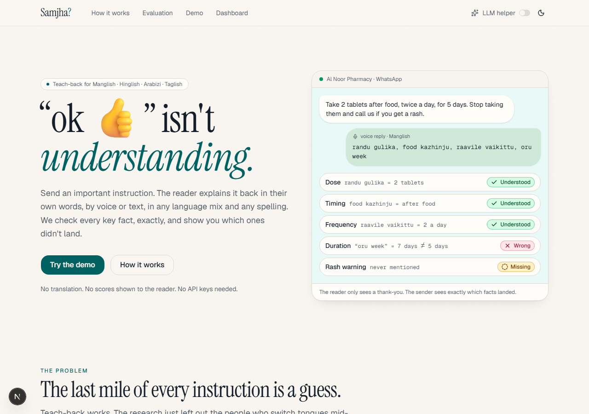
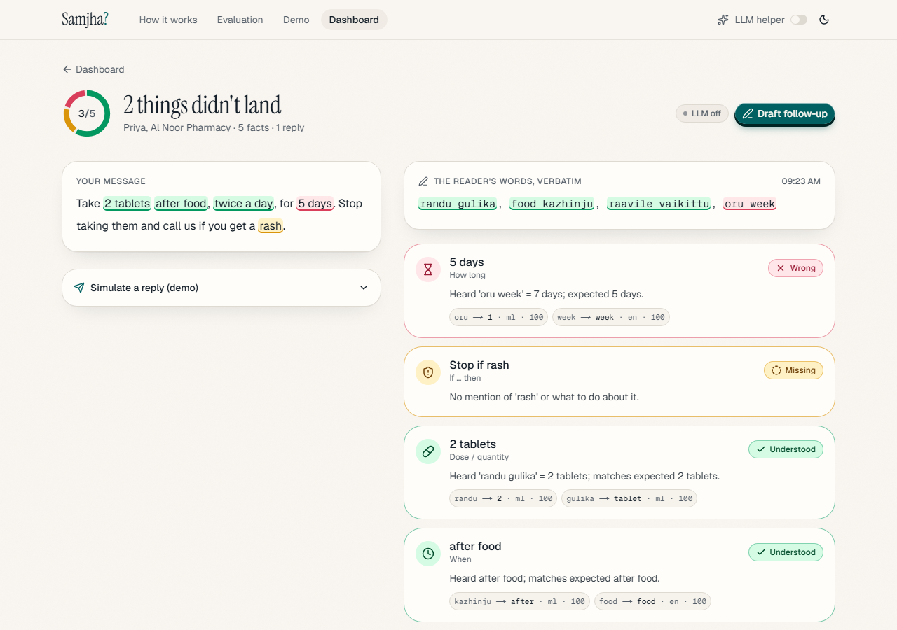
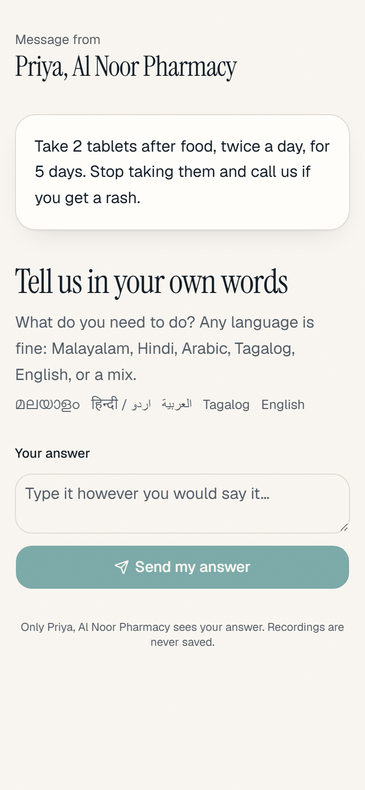
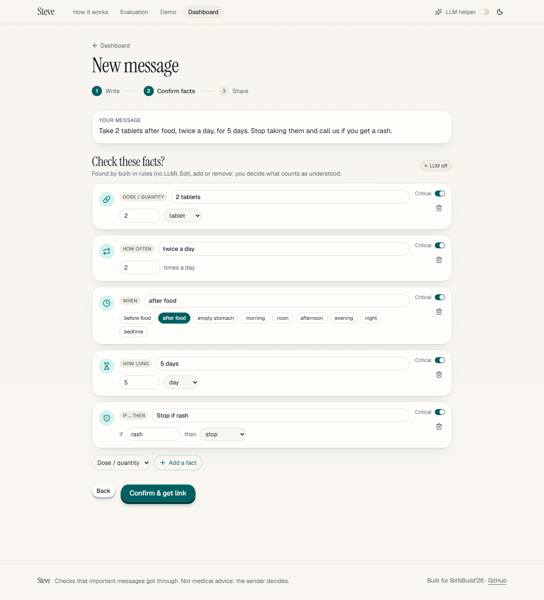
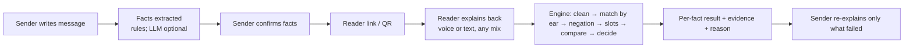

# Samjha?

> **Teach-back for mixed-language messages.** Send an important instruction. The reader explains it back in Manglish, Hinglish, Arabizi or Taglish, spelled however they like, and we check every key fact, *exactly*.

   

**BitNBuild'26 · UAE regional round · AI/ML track** &nbsp;|&nbsp; 🎥 **Demo video:** _add link here_ &nbsp;|&nbsp; 🌐 **Live demo:** _add link here_

| | |
|---|---|
|  |  |
|  |  |

_Screenshots are real (Playwright against the running app). Replace or add GIFs from the demo recording._

---

## 1. The problem, and how we read it

> *"Language tools learn one clean official version of a language, then meet people who switch tongues within a sentence, spell by ear, and write one language in another's script."*

Most teams will build a translator or a normaliser that turns mixed language into "proper" English. **We deliberately don't**: that forces people back into the one clean version the statement criticises.

The three workshop questions, answered:

| Question | Our answer |
|---|---|
| **What did we cross out?** | **Translation / normalisation.** We never translate the message or the reply. The reader's words are shown verbatim. |
| **What is the different moment?** | **The response.** When someone sends an important instruction (a dose, a visa deadline, a safety rule) the reader answers "ok 👍" and nobody knows if it landed. We fix that moment. |
| **Who else is in the sentence?** | **The sender**, who cannot tell whether the message landed. |

**The product** is the digital version of the clinical **teach-back** method:

1. The sender writes an important message.
2. Key facts are extracted into typed slots; the sender confirms them.
3. The reader explains the message back in their own words, by voice or text, in any mix, spelled any way.
4. Our engine checks every key fact: `understood`, `wrong`, `missing`, `negated` or `unclear`.
5. The sender sees a fact-by-fact result and re-explains only what failed. **The reader is never shown a score.**

## 2. The evidence

- About **19%** of patients' answers about their own prescription labels were wrong; dose (52%) and frequency (28%) errors dominate. [AAFP, 2007](https://www.aafp.org/pubs/afp/issues/2007/0615/p1851a.html)
- Teach-back cut comprehension deficits from **49% to 11.9%** in a 483-patient emergency-department study, but that study **excluded patients with language barriers**. [Int J Emerg Med](https://link.springer.com/article/10.1186/s12245-020-00306-9) · AHRQ recommends teach-back: [tool 5](https://www.ahrq.gov/health-literacy/improve/precautions/tool5.html)
- LLMs score **5-12 F1 points worse** on romanized Indian-language health messages than on native script, because of spelling noise. [arXiv 2512.10780](https://arxiv.org/html/2512.10780v1)
- UAE residents: Indians ~38%, Pakistanis ~17%, Bangladeshis ~7%, Filipinos ~7% (GMI 2026). [source](https://www.globalmediainsight.com/blog/uae-population-statistics/)
- **Closest competitor: Hippocratic AI**, whose AI voice agents make post-discharge calls (active in the UAE via Burjeel). We differ: we are a *checking layer any sender (human or AI) can use*, focused on romanized code-mixed replies, with exact checks on numbers.

## 3. How it works



Engine pipeline (all deterministic, all in [`engine/`](engine/samjha_engine)): **clean** (offsets preserved) → **match by ear** (exact / suffix / sound key / guarded fuzzy over a multilingual lexicon) → **negation** (per-language scope) → **slots** (dose, frequency, timing, duration, date, amount, condition) → **compare** (exact) → **decide** (low confidence never becomes "understood"). Details: [docs/architecture.md](docs/architecture.md).

Example: `randu gulika, food kazhinju, raavile vaikittu, oru week` against *2 tablets · after food · twice a day · 5 days · stop if rash* gives dose ✅, timing ✅, frequency ✅ (inferred from morning + evening, lower confidence), **duration ❌ "oru week" = 7 days ≠ 5 days**, **rash warning ⚠️ missing**.

## 4. Why this is not an AI wrapper

1. **An LLM is never the final judge of a safety-critical fact.** Numbers, doses, frequencies, durations, dates, amounts and negations are decided by deterministic code we wrote and tested (145 engine tests).
2. **The engine runs with zero API keys.** LLMs are optional helpers: (a) suggesting facts the sender confirms, (b) the evaluation baseline. Speech-to-text is optional; typed replies always work.
3. **No translation features anywhere.**
4. **A false "understood" is the worst error.** When confidence is low the answer is `unclear`, never `understood`. A conflicting second value is `unclear`.
5. **Every result is explainable:** exact evidence spans plus a plain-English reason.
6. **The wrapper test:** flip the *LLM helper* switch in the nav (it calls `POST /settings/llm`). Compose, reply and check all keep working, and the results page shows an "LLM off" badge.

What we built ourselves: the multilingual lexicon and by-ear matcher, per-language suffix and negation-scope rules, the slot fillers, the exact comparison and confidence logic, the claiming/conflict rules between facts, the evaluation harness, and the whole product around it.

## 5. Features

- Sender dashboard with status rings, filters, seeded demo data · composer with editable fact chips (works with the LLM off) · share sheet (link, QR, prefilled WhatsApp message)
- **Live results over SSE**: cards flip from shimmer to status, the reader's transcript is shown verbatim with evidence spans highlighted (hover a card ↔ its words), matched terms with scores (`randu → 2 · ml · 100`)
- Follow-up draft for **failed facts only**
- Reader page (mobile-first, no login): huge record button, live waveform, timer, re-record, text fallback; hides voice gracefully when STT is off
- `/how-it-works`: stage-by-stage inspector (tokens, lexicon matches, negation, slots, results) and the wrapper-test toggle
- `/eval`: metrics computed from `eval/results/*.json` only (never hard-coded), confusion matrix, error explorer
- `/demo`: pre-seeded scenarios and one-click preset replies so a video never depends on a microphone
- Light/dark theme, reduced-motion support, keyboard accessible (Lighthouse accessibility 98-100 on the main pages in dev mode)

## 6. Tech stack

| Layer | Tech |
|---|---|
| Engine | Python 3.11+, `rapidfuzz`, `pyyaml`, `pydantic`; optional `sentence-transformers` (multilingual-e5-small) for the disabled-by-default condition fallback |
| API | FastAPI, Pydantic v2, SQLModel on SQLite, `httpx`, `python-dotenv`, Server-Sent Events |
| Optional LLM | Google Gemini via `google-genai` (fact suggestion + eval baseline only) |
| Optional STT | Sarvam AI Saaras (`saaras:v3`, `mode=translit`: romanized, **not** translated) behind a `SpeechToText` interface with a `NullSpeechToText` fallback |
| Web | Next.js (App Router), TypeScript strict, Tailwind v4, shadcn/ui, Framer Motion, TanStack Query, Recharts, `qrcode.react`, `sonner`; Geist + Instrument Serif |
| Tooling | `pytest`, `ruff`, ESLint + Prettier, Docker Compose, Makefile |

## 7. Evaluation

Methodology: 15 messages with gold facts (`data/messages.json`) × replies with per-fact gold labels (`data/replies.csv`):
**hand-written** replies (written by a human reading them; a *development* seed set and a small *held-out* set), plus **synthetic** variants expanded from templates
(`eval/generate.py`: swapped numbers, spelling variants, word order, dropped facts, negation flips, typos), always marked `synthetic=true` and reported separately.
Metrics (`eval/metrics.py`): fact-level accuracy, **false "understood" rate** (gold ∈ {wrong, missing, negated} but predicted understood), per-language and per-type breakdowns, confusion matrix, and the Gemini baseline's self-consistency over 5 runs. Run it yourself: `make eval`.

<!-- EVAL:START -->
_Generated by `eval/update_readme.py` from `eval/results/latest.json` on 2026-09-25T21:29:28+00:00. 2268 labelled fact checks across 561 replies (114 hand-written, 447 synthetic)._

| System / slice | Fact checks | Accuracy | False “understood” |
|---|---:|---:|---:|
| **Our engine · all** | 2268 | 96.7% | 0/921 (0.0%) |
| Our engine · handwritten | 332 | 98.8% | 0/69 (0.0%) |
| Our engine · held-out | 175 | 89.1% | 0/41 (0.0%) |
| Our engine · synthetic | 1761 | 97.1% | 0/811 (0.0%) |
| Our engine · arabizi | 402 | 96.0% | 0/188 (0.0%) |
| Our engine · english | 518 | 98.6% | 0/209 (0.0%) |
| Our engine · hinglish | 496 | 95.6% | 0/193 (0.0%) |
| Our engine · manglish | 426 | 97.2% | 0/160 (0.0%) |
| Our engine · taglish | 426 | 96.0% | 0/171 (0.0%) |

**LLM baseline: not run** (no Gemini key when this was generated), so no comparison is claimed. Set `GEMINI_API_KEY` and run `make eval`.

**Caveats** (please read):
- Synthetic variants are generated from team-written templates that reuse vocabulary the lexicon knows, so they overestimate real-world accuracy. Compare the hand-written row.
- The hand-written seed replies were drafted by the developer/assistant, not native speakers, and the engine was iterated while looking at this set. Treat all numbers as development-set numbers.
- Lexicon entries for non-English languages are unverified until native speakers review LEXICON_REVIEW.md.
- Gold labels for synthetic rows come from construction; for hand-written rows from a human reading the reply. Some real-world replies are genuinely ambiguous.
- The LLM baseline was not run (no Gemini key), so no comparison is claimed.
<!-- EVAL:END -->

**Read this honestly.** The engine was developed while reading this data, and the synthetic replies reuse vocabulary the lexicon already knows, so these are *development* numbers, not a claim about real-world accuracy. The held-out set's first blind run (before any fix) scored **87.4%** accuracy with 0 false "understood" out of 41; we then fixed what it exposed, so it is no longer blind ([DECISIONS D10](DECISIONS.md)). "0 false understood" on small denominators is **not** evidence of 0%. The known residual risk is a misspelled negation word we do not recognise. We need real replies from real speakers (next section).

### Adding real replies (teammates, please!)

1. Add rows to `data/replies.csv`: `reply_id, message_id, lang_mix, reply_text, gold_labels, author, synthetic` with `synthetic=false`. `gold_labels` is JSON mapping each fact id (see `data/messages.json`) to `understood|wrong|missing|negated|unclear` **as a human would judge it, not what the engine says**.
2. Use your own language and spelling; hard cases are the valuable ones (words outside the lexicon, questions, half-answers, typos).
3. Run `make eval`, open `/eval`, and read the error explorer. Fix the *lexicon* (`engine/samjha_engine/lexicon.yaml`) or the rules, never the labels.
4. Native speakers: also review [LEXICON_REVIEW.md](LEXICON_REVIEW.md); every non-English entry is `verified: false` until you sign it off. Remove words you doubt rather than keeping guesses.

## 8. Setup

**Prerequisites:** Python 3.11+, Node 20+ (22 tested), optionally Docker. No API keys are required.

```bash
cp .env.example .env        # optional: all keys can stay empty
make install                # pip install -e engine api  +  npm install
make dev                    # api on :8000 and web on :3000 together
```

No `make` (Windows)? Run the same steps directly:

```powershell
py -3.12 -m venv .venv ; .\.venv\Scripts\Activate.ps1
pip install -e "engine[dev]" -e "api[dev]"
cd api ; uvicorn app.main:app --reload --port 8000        # terminal 1
cd web ; npm install ; npm run dev                         # terminal 2
```

Open <http://localhost:3000/demo> (it seeds four UAE scenarios) or <http://localhost:3000/app/new>.

| Variable | Purpose |
|---|---|
| `LLM_ENABLED` | `true` lets Gemini *suggest* facts (needs `GEMINI_API_KEY`). Also toggleable at runtime from the nav. |
| `GEMINI_API_KEY`, `GEMINI_MODEL` | Optional. Check <https://ai.google.dev/gemini-api/docs/models> for the current model id. |
| `SARVAM_API_KEY`, `STT_ENABLED` | Optional voice replies (Malayalam, Hindi, English). Arabizi and Taglish are typed for now. |
| `DATABASE_URL` | Default `sqlite:///./samjha.db` |
| `PUBLIC_WEB_URL`, `CORS_ORIGINS` | Where the web app lives (used in reader links / CORS) |
| `UNCLEAR_THRESHOLD` | Confidence below this becomes `unclear` (default 0.6) |
| `NEXT_PUBLIC_API_URL` | Web → API base URL (default `http://localhost:8000`) |

**Docker:** `docker compose up --build` (api :8000, web :3000, SQLite volume).
**Tests:** `make test` (engine 145 + API 15) · `make lint` · **Eval:** `make eval` (works without a Gemini key; the baseline is then skipped and clearly marked "not run").
**Phone testing:** the microphone needs HTTPS or localhost. Use a tunnel or a deployed URL for real-phone voice.
**Deploy:** web → Vercel (`NEXT_PUBLIC_API_URL` = your API URL); API → Render / Railway / Fly using `api/Dockerfile` (build context = repo root), set `PUBLIC_WEB_URL` and `CORS_ORIGINS` to the web URL, mount a volume for SQLite.

## 9. Project structure

```
engine/   pure-Python checker: lexicon.yaml, matcher, slots, negation, compare, check_reply()   (+145 tests)
api/      FastAPI: routes, SQLModel db, extractor, STT interface, follow-up drafts, SSE           (+15 tests)
web/      Next.js app: landing, /app, /app/new, /app/m/[id], /r/[token], /eval, /how-it-works, /demo
data/     scenarios.json (demo), messages.json + replies.csv (eval gold data)
eval/     generate.py, run_engine.py, run_baseline.py, metrics.py, update_readme.py, results/
docs/     architecture.md, demo-script.md, screenshots/, build-prompt.md
DECISIONS.md · LEXICON_REVIEW.md · docker-compose.yml · Makefile · .env.example
```

## 10. Limitations and ethics

- **Not medical advice.** Samjha checks whether a message was understood; the sender decides what to do. It is not a clinical device.
- **Lexicon coverage is small and unverified.** Five languages, ~300 headwords, every non-English entry awaiting native-speaker review. Unknown words produce `missing` or `unclear`, never a guess. Numbers above ten are only recognised as digits.
- **Synthetic and self-authored eval data** (see Evaluation). Baseline numbers appear only if the baseline actually ran.
- **Known weak spots:** misspelled negation words; replies that use an unlisted word for a fact ("pani" for fever, "saade barah baje" for 12:30); an unnumbered "form"/"bottle" is counted as one; two unmatched facts of the same kind can only be `unclear`.
- **Privacy:** audio is held in memory for a single STT request and never stored; the reader never sees results; replies are stored as text.
- **Voice** uses Sarvam (Indian languages); Gulf Arabic and Tagalog voice are not supported yet.
- **Closest competitor** and how we differ: see §2.

## 11. Roadmap

Native-speaker lexicon verification and a real blind test set · Arabic/Tagalog voice · WhatsApp Business API delivery (today: copy/QR) · Arabic-script and Devanagari input · larger numbers and ordinals per language · calibrate and enable the embedding fallback for conditions · per-sender templates for follow-ups in more languages · multi-message conversations.

## 12. Team

_Add names and roles here._ Built for BitNBuild'26 by the **Samjha** team.
