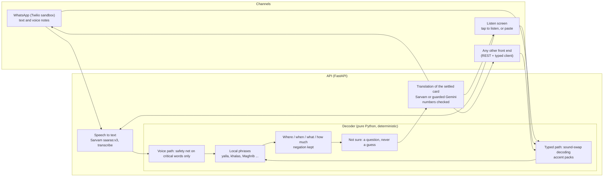
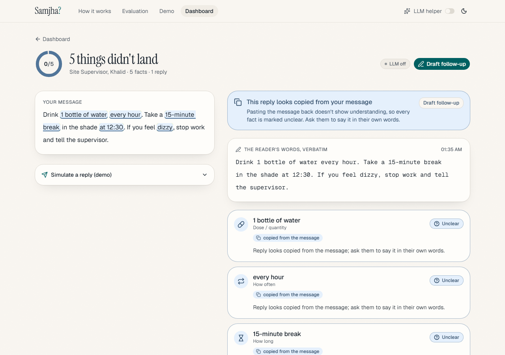
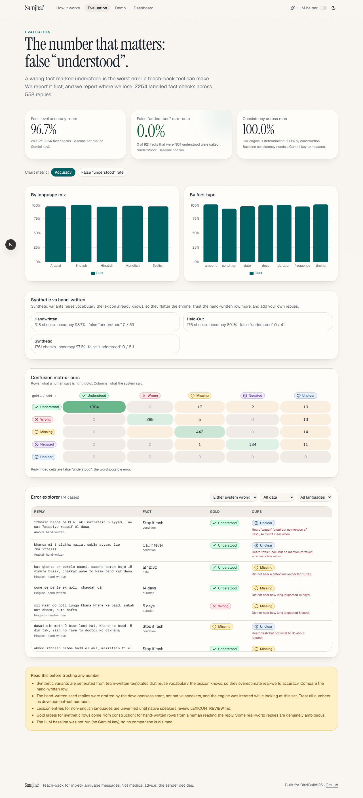
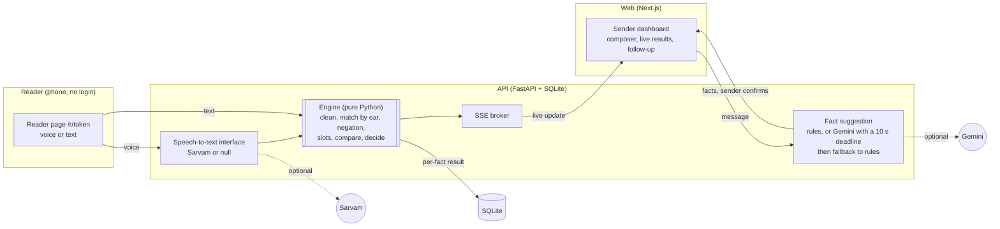

# Steve

> **You know the language. You still miss the message.**
> Accents, local slang, borrowed words. You nod, say "ok," and miss the one detail that mattered.

[](https://github.com/Adithya-Sharath/Steve/actions/workflows/ci.yml)
[](LICENSE)


 


**BitNBuild'26 · UAE regional round · AI/ML track** &nbsp;|&nbsp; [▶ Watch the 2-minute demo](VIDEO_LINK_HERE)

**Steve Decode** is an interpreter for the *listener*: it takes what a worker in the UAE hears (a voice note, a forwarded message, a colleague speaking) and returns plain English:
**where, when, what to do and how much**, with local phrases explained and, when Steve is not sure, a question instead of a guess. It works over **WhatsApp** and in person
("tap to listen"), and everything it says back is **text**. The first product, **Check mode** (teach-back for the *sender*), is kept and still works: see [Check mode](#check-mode-teach-back).

```
Someone says:  "Yalla, drop it at Al Quoz before Maghrib. No signature, just call the guy."

📍 Where: al quoz
⏰ When: maghrib
✅ What: drop
💬 They said: "Yalla, drop it at Al Quoz before Maghrib. No signature, just call the guy."
ℹ️ yalla = come on / let's go
ℹ️ maghrib = the sunset prayer
```

That is the real WhatsApp reply for that sentence (an automated test compares this block with the engine's output). **It is narrower than a person would be:** it reads the first
action verb only ("drop", not "then call the person") and does not pull out "no signature needed". Steve is honest about what it did not extract; the plain-English sentence and the
original are always next to the extracted lines.

## The problem, and the gap

Workers in the UAE hear English from people with many mother tongues: **"barking" for "parking"** (Arabic has no /p/), "wery" for "very", "fife" for "five", plus "yalla", "khalas",
"inshallah", "kindly revert". The listener nods and misses the one detail that mattered: which gate, what time, how much. Research on English as a lingua franca (for example
Jenkins' *Lingua Franca Core*) argues that most mother-tongue accents are fine for understanding each other, and that misunderstandings come from a few features and from local
phrases nobody explained. Yet nearly all accent tools work on the **speaker's** side: they change how people speak. **Every accent tool changes how people speak. Steve helps the people who have to listen.**

## How Steve Decode works



* **Voice path:** speech-to-text already normalises most accent-shaped words on clear audio (44 of 48 real-word swaps in our first test, 89.9% of 476 in the larger one), so the decoder trusts a
  transcript and only re-examines a **critical word** (a place, time, amount or number) that fits its sentence badly. It rewrites only when one sound-alike clearly wins, asks when two are close, and **never silently rewrites a negation, a number, an amount or a named time.**
* **Typed path (WhatsApp messages spelled by ear):** full sound-swap decoding with five accent packs (common, Arabic, Hindi/Urdu, Malayalam, Filipino): "barking gate tree" becomes "parking gate 3" because a place and a number fit there.
* **No LLM decides where, when, what or how much.** Everything is deterministic rules. Gemini is optional, guarded, and only used for translation (Tagalog and as a fallback). **Everything works with zero API keys**: typed text always gives an English card; voice, translation and WhatsApp degrade with a clear message.
* **Text only.** There is no text-to-speech anywhere. "Say it back" is a short English phrase shown as text for the worker to show the other person.
* **Never shaming:** nothing says "wrong" or "bad English", and no score is ever shown.
* **Privacy:** audio and message text are never stored and never logged; a clarifying question keeps the text in memory for 10 minutes; phone numbers are hashed with a secret; the only things kept are the hash, the language choice and two anonymous counters.

## The Decode API (public contract)

The API is the product; the web `/listen` screen is only a small reference front end. Everything a separate UI needs is in this repo:

| | |
|---|---|
| [`docs/API.md`](docs/API.md) | every endpoint with real JSON (generated from the running app), error codes, the `X-Worker-Key` header, limits, privacy |
| [`openapi.json`](openapi.json) | the machine-readable contract (`python scripts/export_openapi.py`; a test fails when it is stale) |
| [`clients/ts/steve-client.ts`](clients/ts/steve-client.ts) | a dependency-free typed client: `decode()`, `decodeAudio()`, `clarify()`, `health()`, `examples()` |
| `GET /decode/examples` | six live outputs from the engine (including the Al Quoz / Maghrib sentence) for demo buttons |
| CORS | `CORS_ORIGINS` (a list or `*`): another site can call the API from a browser |

```ts
import { SteveClient } from "./clients/ts/steve-client";
const steve = new SteveClient({ baseUrl: "http://localhost:8000" });
const res = await steve.decode({ text: "yalla habibi come to the barking gate tree", accentHint: "ar", replyLanguage: "ml" });
res.card?.actions.where?.value;   // "parking gate 3"
res.translation?.plain_english;   // the same card in Malayalam, only if it passed the number check
```

Response shapes are stable; changing one needs a decision record ([DECISIONS.md](DECISIONS.md), D47).

## Evaluation, honestly

**Every number here comes from public read speech or from synthetic, author-written data. There are no real workers, no real voice notes and no real messages in any of it (real-world validation is missing).**
The sets and the scorer are in `eval/` and `data/decode/`; how each number came about, including what was tuned on it, is in [DECISIONS.md](DECISIONS.md) (D39 to D44, D49).

| What | Result | Label |
|---|---|---|
| **False alarm** (a correct sentence that got any change or question), v2 first run | **1.4% (2/144)**, both questions, no rewrites | synthetic, author-written; v2 was written after the engine was tuned and scored once |
| Same, v1 first run | 0 of 272 | synthetic, author-written; frozen before its first run (fixes were then made on it, so v1 after the fixes is contaminated) |
| **Typed-by-ear decode**, respellings the accent packs cover (v2 first run) | **94.0% exact (63/67)**, 3 asked, 1 partly decoded | synthetic; the respellings are generated by letter rules |
| Typed-by-ear, respellings the packs do **not** model (v2) | **0 of 34 decoded**, all left as typed, none mis-decoded | the honest limit: real people vary far more |
| **Where / when / what / how much** on correct text (v2 first run) | 91.7% / 87.1% / 95.0% / 100% correct; 0 wrong values | synthetic; two slot-values ("main gate" for "gate") are stricter than a person would be |
| Voice safety-net **catch rate** | **66.5% (125/188)**: *synthetic, author-written, tuned on it*. On held-out L2-ARCTIC it is **0/72** because those errors fall outside the critical slots | never quote the first number without its label |
| Speech-to-text (Sarvam `transcribe`) on accented read speech | wrote the intended word for real-word swaps 89.9% of the time (428/476), 87.4% on a WhatsApp-like noisy copy | public read speech (L2-ARCTIC, studio quality), directional only; the WhatsApp-like copy is a simulation (noise at 10 dB, 8 kHz, Opus 16 kbps) |
| Translation | one live Sarvam call (Malayalam) and one Gemini call (Tagalog) kept every number; nobody has checked that a **negation** survives | not an evaluation |

### Gemini baseline on the same v2 set

_The Gemini baseline on the v2 set has not been run yet._


## Quick start

No API keys are required for any of this.

**Windows (PowerShell)**

```powershell
git clone https://github.com/Adithya-Sharath/Steve.git
cd Steve
py -3 -m venv .venv
.\.venv\Scripts\Activate.ps1
pip install -e "engine[dev]" -e "api[dev]"
cd web; npm install; cd ..

# terminal 1: API
cd api; uvicorn app.main:app --port 8000

# terminal 2: web
cd web; npm run dev
```

**macOS / Linux**

```bash
git clone https://github.com/Adithya-Sharath/Steve.git
cd Steve
python3 -m venv .venv && source .venv/bin/activate
pip install -e "engine[dev]" -e "api[dev]"
(cd web && npm install)
make dev        # API on :8000 and web on :3000 together
```

Then try `curl localhost:8000/decode/examples`, open <http://localhost:3000/listen> (Paste tab works without any key), or read [`docs/API.md`](docs/API.md).
Prerequisites: Python 3.11+, Node 20+ (22 tested). Optional keys (`cp .env.example .env`): `SARVAM_API_KEY` (voice notes and translation into Malayalam, Hindi, Urdu, Bengali), `GEMINI_API_KEY` with `LLM_ENABLED=true` (Tagalog and fallback translation).
**WhatsApp:** off by default; the exact steps for the Twilio sandbox are in [`docs/whatsapp-setup.md`](docs/whatsapp-setup.md) (nothing sends a message until you switch it on).
Docker: `docker compose up --build` (the images have not been built in our environment; the compose file is only validated).

## Configuration

Copy `.env.example` to `.env`. Everything is optional.

| Variable | Purpose |
|---|---|
| `LLM_ENABLED` | `true` lets Gemini *suggest* facts (needs `GEMINI_API_KEY`). The operator can also flip it at runtime with `ADMIN_KEY`. |
| `ADMIN_KEY` | Operator key (header `X-Admin-Key`, constant-time compare) for the **global** LLM switch, `POST /settings/llm`. Unset = the switch is disabled for everyone and `LLM_ENABLED` decides. Use 32+ random characters; paste it once on the unlinked `/admin` page to show the switch in the nav. |
| `GEMINI_API_KEY`, `GEMINI_MODEL` | Optional. `GEMINI_MODEL` defaults to **`gemini-3.1-flash-lite`**: larger Gemini models allow only about 20 requests/day on a free key. Model ids: <https://ai.google.dev/gemini-api/docs/models>. |
| `LLM_TIMEOUT_SECONDS`, `LLM_COOLDOWN_SECONDS` | Fact suggestion has a hard **10 s** deadline (default; the Gemini API itself rejects anything under 10 s), then the built-in extractor answers. After a failure the LLM is skipped for 60 s (15 min after a daily-quota error), so "Find key facts" never hangs. |
| `SARVAM_API_KEY`, `STT_ENABLED` | Optional voice replies (Malayalam, Hindi, English). `STT_ENABLED` defaults to `true` but only takes effect when a key is set. Arabizi and Taglish are typed for now. |
| `DATABASE_URL` | Default `sqlite:///./steve.db` |
| `STEVE_DATA_DIR`, `STEVE_EVAL_DIR` | Override where the API reads scenario data and evaluation results (used by the Docker image). |
| `PUBLIC_WEB_URL`, `CORS_ORIGINS`, `CORS_ALLOW_LOCALHOST` | Where the web app lives (reader links) and which origins may call the API from a browser: a comma-separated list, or `*` for any origin (no cookies are used, keys travel in headers). `CORS_ALLOW_LOCALHOST=false` removes the built-in "any localhost port" rule. Another site (for example a separate demo UI) is allowed by listing its origin. |
| `TRUST_PROXY`, `TRUSTED_PROXIES` | Default `false`. Set `true` only behind a reverse proxy or tunnel to read the client IP from `CF-Connecting-IP` / the right-most untrusted `X-Forwarded-For` entry (`TRUSTED_PROXIES`: extra hops to skip, IPs/CIDRs). When false those headers are ignored, because clients can forge them. |
| `UNCLEAR_THRESHOLD` | Confidence below this becomes `unclear` (default 0.6). |
| `RL_MESSAGES_PER_MIN`, `RL_MESSAGES_PER_DAY`, `RL_MESSAGES_PER_SENDER_DAY` | `POST /messages` limits: per IP per minute (10) and per day (100), and per sender key per day (30). |
| `REPLY_RATE_LIMIT`, `REPLY_CAP_PER_MESSAGE` | Replies: maximum per minute from one client to one reader link (12), and a hard cap of stored replies per message (30). |
| `RL_CHECK_PER_MIN`, `RL_SEED_PER_MIN`, `RL_DEFAULT_PER_MIN` | `/check` and `/analyze` (60/min per IP each), `/demo/seed` (5/min), every other route (120/min per IP). A value of 0 turns a rule off; blocked requests get `429` with `Retry-After`. |
| `LLM_DAILY_CAP`, `STT_DAILY_CAP` | Global calls per UTC day to Gemini (200) and Sarvam (300). Over the cap the built-in extractor answers ("daily AI limit reached") and voice replies ask the reader to type. `/health` shows what is left. `0` blocks the service, negative means unlimited. |
| `WHATSAPP_ENABLED`, `TWILIO_ACCOUNT_SID`, `TWILIO_AUTH_TOKEN`, `WORKER_HASH_SECRET`, `WHATSAPP_WEBHOOK_URL` | WhatsApp (Twilio sandbox), off by default. `WORKER_HASH_SECRET` (32+ random characters) is required when it is on: phone numbers are hashed with it and never stored. `WHATSAPP_WEBHOOK_URL` is the exact URL configured in Twilio. Setup: [`docs/whatsapp-setup.md`](docs/whatsapp-setup.md). |
| `WA_PER_NUMBER_HOUR`, `WA_PER_NUMBER_DAY`, `RL_WHATSAPP_PER_MIN` | WhatsApp limits: 20 messages per hour and 100 per day per number, and 300 webhook calls per minute per IP. |
| `RL_DECODE_PER_MIN`, `RL_DECODE_PER_DAY`, `DECODE_PER_WORKER_DAY` | Decode (`POST /decode`): per IP per minute (30) and per day (500), and per worker key per day (200). |
| `SARVAM_BASE_URL` | Tests and proxies only (default `https://api.sarvam.ai`): the browser tests point it at a local mock. |
| `TRANSLATE_DAILY_CAP` | Global translation calls per UTC day (default 300, Sarvam and Gemini together). Over the cap, or with no provider, the card stays in English with a note. |
| `DECODE_MAX_AUDIO_BYTES`, `DECODE_MAX_AUDIO_SECONDS`, `CLARIFY_TTL_SECONDS` | Decode voice notes: at most 4 MB and 30 s (the length is read from WAV and Ogg files; other formats rely on the byte cap and Sarvam's own 30 s limit). An open clarifying question is kept in memory for 600 s, never on disk. |
| `MAX_BODY_BYTES` | Requests larger than this are refused with 413 (default 5 MB). |
| `STEVE_EMBEDDINGS` | Set to `1` to enable the optional embedding fallback for condition facts (needs `sentence-transformers`; off until calibrated). |
| `NEXT_PUBLIC_API_URL` | Web to API base URL (default `http://localhost:8000`); baked in at build time. |

**Phone testing:** the microphone needs HTTPS or localhost. A free Cloudflare tunnel for the web app and one for the API works well: set `PUBLIC_WEB_URL` and `CORS_ORIGINS` to the web tunnel address, `NEXT_PUBLIC_API_URL` to the API tunnel address, **`TRUST_PROXY=true`** (the tunnel sends `CF-Connecting-IP`, so each visitor gets their own rate-limit bucket instead of sharing the tunnel's address), then rebuild the web app. Do not also expose port 8000 to your network while `TRUST_PROXY=true`.
**Deploy:** web on Vercel (`NEXT_PUBLIC_API_URL` = your API URL); API on Render, Railway or Fly using `api/Dockerfile` (build context = repo root), with `PUBLIC_WEB_URL` and `CORS_ORIGINS` set to the web URL and a volume for SQLite.

## Check mode (teach-back)

The original product, kept and fully working (tag `check-mode-v1`; `/app`, `/demo`, `/r/<token>` in the web app): a **sender** writes an important message, confirms its key facts, and the
**reader explains it back** in their own mix of languages; a deterministic engine marks each fact `understood`, `wrong`, `missing`, `negated` or `unclear`. Everything below in this section is about Check mode.

### About the name

Steve comes from the meme "it's me and you, and you and me, and your friend Steve": the friend in the middle who makes sure the two of you actually understood each other. The project started as "Samjha" (Hindi/Urdu for "understood?").

### The problem

- About **19%** of patients' answers about their own prescription labels were wrong, mostly dose (52%) and frequency (28%). [AAFP, 2007](https://www.aafp.org/pubs/afp/issues/2007/0615/p1851a.html)
- Teach-back cut comprehension deficits from **49% to 11.9%** in a 483-patient emergency-department study, but that study **excluded patients with language barriers**. [Int J Emerg Med](https://link.springer.com/article/10.1186/s12245-020-00306-9) · AHRQ recommends teach-back ([tool 5](https://www.ahrq.gov/health-literacy/improve/precautions/tool5.html))
- In the UAE, residents are about 38% Indian, 17% Pakistani, 7% Bangladeshi and 7% Filipino (GMI 2026), and many switch languages mid-sentence and write one language in another's script. [source](https://www.globalmediainsight.com/blog/uae-population-statistics/)

### What Steve does

1. **The sender writes** an important message (a dose, a visa deadline, a safety rule).
2. **Key facts are confirmed.** Facts are extracted into typed slots; the sender confirms or edits them.
3. **The reader explains it back**, by voice or text, in any language mix and any spelling, from a link or QR code with no login.
4. **The engine checks each fact:** `understood`, `wrong`, `missing`, `negated` or `unclear`, with the evidence and a plain reason.
5. **The sender sees what didn't land** and re-explains only that. **The reader is never shown a score**, only a thank-you.

Example: `randu gulika, food kazhinju, raavile vaikittu, oru week` against *2 tablets, after food, twice a day, 5 days, stop if rash* gives dose understood, timing understood, frequency understood (inferred from morning and evening, lower confidence), **duration wrong ("oru week" = 7 days, not 5)** and **rash warning missing**.

### How we read the problem statement

> *"Language tools learn one clean official version of a language, then meet people who switch tongues within a sentence, spell by ear, and write one language in another's script."*

| Workshop question | Our answer |
|---|---|
| **What did we cross out?** | ~~Translation and normalisation.~~ Most tools turn mixed language into "proper" English, which forces people back into the one clean version the statement criticises. Steve never translates the message or the reply; the reader's words are shown verbatim. |
| **What is the different moment?** | **The response**, not the message. Everyone works on how instructions are sent; nobody checks what happens when the reader answers a bare "ok". |
| **Who else is in the sentence?** | **The sender**, who cannot tell whether the message landed. Steve is built for them. |

### Why this isn't an AI wrapper

1. **An LLM is never the judge of a safety-critical fact.** Numbers, doses, frequencies, durations, dates, amounts and negations are decided by deterministic code we wrote and tested (579 engine tests).
2. **Zero keys needed.** LLMs are optional helpers: (a) suggesting facts the sender confirms, with a 10 s deadline and automatic fallback to the built-in extractor; (b) the evaluation baseline. Speech-to-text is optional; typed replies always work.
3. **The LLM-off test.** Run with `LLM_ENABLED=false`, or (as the operator, with `ADMIN_KEY` set and pasted once on `/admin`) flip the *LLM helper* switch in the nav. Compose, reply and check all keep working and the results page shows an "LLM off" badge. The switch is global, so it is admin-only and hidden from everyone else.
4. **A false "understood" is the worst error,** so low confidence, conflicts, concessives ("even if rash") and pasted-back messages end in `unclear`, `missing` or `negated`, never `understood`.
5. **Why not just ask an LLM?** LLMs score 5-12 F1 points worse on romanized Indian-language health messages than on native script, because of spelling noise ([arXiv 2512.10780](https://arxiv.org/html/2512.10780v1)). We measured a baseline (table below): on the same 180 not-understood facts, **our engine has 0 false "understood" and the Gemini baseline has 11**. In the interest of honesty: the baseline is slightly *more accurate* on plain accuracy (96.6% vs 95.9% once pasted-message rows are excluded), and our engine was tuned while reading this data, so the comparison favours us.
6. **Voice via Sarvam, verified live on an iPhone in Malayalam.** Speech-to-text is Sarvam Saaras in transliteration mode (romanized, **not** translated) behind a `SpeechToText` interface with a null fallback. The recording is sent for one request and never stored.

### Screenshots

| | | |
|---|---|---|
|  |  |  |
| **Landing.** The pitch, and a live example of message, voice reply and per-fact result. | **Composer.** Facts are extracted into chips the sender confirms; works with the LLM off. | **Results.** Cards flip from shimmer to status over SSE; the reader's words stay verbatim with evidence highlighted. |
|  |  |  |
| **Reader (mobile).** Big record button, text fallback, no login and no score. | **Copied reply.** A reply that just parrots the message is flagged instead of counted as understood. | **Evaluation.** Metrics computed from `eval/results/*.json`, confusion matrix, error explorer. |

More: [results in dark mode](docs/screenshots/results-dark.png) · [recording with a mic-level halo](docs/screenshots/reader-recording.png) · [buttons: rest, hover, pressed](docs/screenshots/buttons.png) · [stats bento](docs/screenshots/landing-problem.png) · [how-it-works timeline](docs/screenshots/landing-how.png)

_Screenshots are real: Playwright against a production build (`next build && next start`)._

### Architecture



| Component | What it is |
|---|---|
| [`engine/`](engine/steve_engine) | Pure-Python checker: multilingual lexicon, by-ear matcher (exact, suffix, sound key, guarded fuzzy), per-language negation scope, slot fillers, exact comparison, copy detection. No network, no LLM. |
| [`api/`](api) | FastAPI and SQLModel on SQLite. Sender-key auth, reader-token endpoints, fact suggestion, speech-to-text interface, follow-up drafts, Server-Sent Events. |
| [`web/`](web) | Next.js App Router, TypeScript, Tailwind v4, shadcn/ui, Framer Motion, TanStack Query. Sender dashboard, mobile reader page, `/how-it-works`, `/eval`, `/demo`. |
| [`eval/`](eval) | Data generator, engine runner, Gemini baseline runner, metrics, README updater. |

Pipeline detail: [docs/architecture.md](docs/architecture.md).

### Testing and evaluation

**Tests:** `make test` (engine 579 + API 417), `make lint`; without `make`, `scripts/test.ps1` or the commands in [CONTRIBUTING.md](CONTRIBUTING.md). CI runs them on every push.
**Evaluation:** `make eval` (works without a Gemini key; the baseline is then skipped and clearly marked "not run").

Methodology: 15 messages with gold facts (`data/messages.json`) times replies with per-fact gold labels (`data/replies.csv`): **hand-written** replies (a development set and a small held-out set) plus **synthetic** variants expanded from templates (`eval/generate.py`: swapped numbers, spelling variants, word order, dropped facts, negation flips, typos), always marked `synthetic=true` and reported separately. Metrics (`eval/metrics.py`): fact-level accuracy, the **false "understood" rate** (gold is wrong, missing or negated but predicted understood), per-language and per-type breakdowns, a confusion matrix and the baseline's self-consistency.

<!-- EVAL:START -->
_Generated by `eval/update_readme.py` from `eval/results/latest.json` on 2026-09-26T08:16:36+00:00. 2268 labelled fact checks across 561 replies (114 hand-written, 447 synthetic)._

| System / slice | Fact checks | Accuracy | False “understood” |
|---|---:|---:|---:|
| **Our engine · all** | 2268 | 96.9% | 0/921 (0.0%) |
| Our engine · handwritten | 332 | 98.8% | 0/69 (0.0%) |
| Our engine · held-out | 175 | 89.1% | 0/41 (0.0%) |
| Our engine · synthetic | 1761 | 97.3% | 0/811 (0.0%) |
| Our engine · arabizi | 402 | 96.0% | 0/188 (0.0%) |
| Our engine · english | 518 | 98.6% | 0/209 (0.0%) |
| Our engine · hinglish | 496 | 95.6% | 0/193 (0.0%) |
| Our engine · manglish | 426 | 97.2% | 0/160 (0.0%) |
| Our engine · taglish | 426 | 96.7% | 0/171 (0.0%) |
| **Gemini baseline** (same replies, 3 runs, majority vote) | 665 | 94.6% | 11/180 (6.1%) |
| Our engine on the baseline's exact subset | 665 | 95.9% | 0/180 (0.0%) |
| Baseline, excluding 14 pasted-message rows | 651 | 96.6% | 11/180 (6.1%) |
| Our engine, same rows | 651 | 95.9% | 0/180 (0.0%) |

Baseline self-consistency across runs: **100.0%** (our engine: 100%, deterministic). model: gemini-3.1-flash-lite, evaluated on 154 replies (all hand-written + a synthetic sample)

**Caveats** (please read):
- Synthetic variants are generated from team-written templates that reuse vocabulary the lexicon knows, so they overestimate real-world accuracy. Compare the hand-written row.
- The hand-written seed replies were drafted by the developer/assistant, not native speakers, and the engine was iterated while looking at this set. Treat all numbers as development-set numbers.
- Lexicon entries for non-English languages are unverified until native speakers review LEXICON_REVIEW.md.
- Gold labels for synthetic rows come from construction; for hand-written rows from a human reading the reply. Some real-world replies are genuinely ambiguous.
- COMPARISON FAVOURS US: the engine was developed while reading this data; the baseline (gemini-3.1-flash-lite) is one zero-shot prompt that saw none of it. It covers 665 fact checks (154 replies: all hand-written plus a synthetic sample), 3 runs each, majority vote. A stronger model may score higher.
- Where the baseline wins: excluding the 14 pasted-message rows (gold unclear; that rule is ours and was not in its prompt), on the same 651 checks the baseline is MORE accurate than our engine (96.6% vs 95.9%). Our advantage is on false 'understood' (0/180 vs 11/180), not on raw accuracy.
- The baseline agreed with itself on every item across 3 runs, so consistency is NOT an advantage we can claim over this model (our engine is deterministic by construction).
<!-- EVAL:END -->

**Read this honestly.** The engine was developed while reading this data, and the synthetic replies reuse vocabulary the lexicon already knows, so these are *development* numbers, not a claim about real-world accuracy. The held-out set's first blind run (before any fix) scored **87.4%** accuracy with 0 false "understood" out of 41; we then fixed what it exposed, so it is no longer blind ([DECISIONS D10](DECISIONS.md)). "0 false understood" on small denominators is **not** evidence of 0%. The known residual risk is a misspelled negation word we do not recognise. We need real replies from real speakers: see [CONTRIBUTING.md](CONTRIBUTING.md#add-real-replies-most-useful).

## Project structure

```
engine/   pure-Python checkers: Check mode (lexicon.yaml, matcher, slots, negation, compare, check_reply)   (+579 tests)
          and Decode (engine/steve_engine/decode: glossary, accent packs, safety net, actions, decoder)
api/      FastAPI: Decode routes, translation, WhatsApp, Check-mode routes, SQLModel db, STT interface      (+417 tests)
web/      Next.js app: /listen (reference Decode UI), Check mode (/app, /r/[token], /demo), /eval, /how-it-works; e2e/ browser flows
clients/  ts/steve-client.ts, the typed client for the Decode API
data/     decode/ (synthetic evaluation sets), scenarios.json, messages.json + replies.csv (Check-mode eval gold)
eval/     Decode scorer and baseline (decode_eval.py, decode_baseline.py), Check-mode pipeline, results/
tools/    stt_compare/: the speech-to-text reality tests (L2-ARCTIC, noise, Opus) used to design the voice path
docs/     API.md, whatsapp-setup.md, FINAL_AUDIT.md, architecture.md, demo-script.md, build-prompt.md, screenshots/
scripts/  export_openapi.py, make_api_docs.py, Windows helpers (dev.ps1, test.ps1, eval.ps1)
.github/  CI workflow, issue and pull-request templates
openapi.json, DECISIONS.md, PROGRESS.md, CLAUDE.md, ACCENT_REVIEW.md, GLOSSARY_REVIEW.md, LEXICON_REVIEW.md, copy_review.md, CONTRIBUTING.md, SECURITY.md, LICENSE
docker-compose.yml, Makefile, .env.example
```

## Roadmap

- **A real-user pilot** with a small group of workers and their real voice notes and messages, so the numbers stop being development numbers (the single biggest gap).
- **Native-speaker reviews:** the accent packs ([ACCENT_REVIEW.md](ACCENT_REVIEW.md)), the glossary and word lists ([GLOSSARY_REVIEW.md](GLOSSARY_REVIEW.md)), the copy shown to the other person and in WhatsApp ([copy_review.md](copy_review.md)), and the translations of negated instructions.
- **More accent packs and languages** (Bengali, Urdu-specific, Amharic, Nepali ...), and commands in each language.
- **The Meta WhatsApp Cloud API** through the existing provider seam, replacing the Twilio sandbox.
- **Optional voice replies** later, only if workers ask for them and only with consent handling (today there is no audio output anywhere).
- **Multiple actions per message** ("drop it, then call the person") and more slots.
- From Check mode: a call plugin, a B2B dashboard for clinics and pharmacies, calibrating the embedding fallback.

## Limitations and ethics

- **No real-worker validation yet.** Everything above was measured on public read speech and synthetic data written by one author, who also wrote the gold labels and the respellings. Treat every number as a development number.
- **Accent packs, the glossary and the word lists are unreviewed.** Every one is `verified: false` until a native speaker checks it; some meanings (for example *inshallah*) are cultural and may be off. Steve explains phrases and never judges them.
- **Speech-to-text gives no confidence and no alternatives**, so a plausible wrong word ("cold" for "coal") cannot be detected in general. The safety net watches only critical words, and its held-out catch rate is 0/72 on literary sentences.
- **Out-of-pack respellings are not decoded** (0 of 34 on the v2 set): the typed path knows five accent packs, not every way people spell by ear.
- **Translation is machine translation.** Numbers are checked; a negation is not, and the checker cannot read those languages. The English card is always one tap ("Show English") or one reply ("EN") away.
- **Narrow extraction.** One action per message, place and thing words from a fixed list, times such as "half past four" and "six thirty" but not every phrasing.
- **In-person listening needs legal review.** Recording or transcribing another person's speech at work may need consent or be restricted; the app shows the other person a notice while the microphone is on ("Nothing is recorded"), but that wording needs a lawyer (see [copy_review.md](copy_review.md)). **This is not legal advice**, and Steve is not a certified interpreter: do not rely on it for legal, medical or safety-critical decisions.
- **WhatsApp runs on Twilio's sandbox** (shared number, three-day sessions, replies only), and Twilio keeps its own logs and media; see [`docs/whatsapp-setup.md`](docs/whatsapp-setup.md).
- **Limits are a brake, not a shield:** rate limits and daily caps live in the API process (see [SECURITY.md](SECURITY.md)).

- **Check mode is not medical advice.** Steve checks whether a message was understood; the sender decides what to do. It is not a clinical device.
- **Lexicon coverage is small and unverified.** Five languages, about 300 headwords, every non-English entry awaiting native-speaker review. Unknown words produce `missing` or `unclear`, never a guess. Numbers above ten are only recognised as digits.
- **Known weak spots:** misspelled negation words; replies that use an unlisted word for a fact ("pani" for fever, "saade barah baje" for 12:30); an unnumbered "form" or "bottle" is counted as one; two unmatched facts of the same kind can only be `unclear`.
- **Closest competitor: Hippocratic AI**, whose AI voice agents make post-discharge calls (active in the UAE via Burjeel). We differ: Steve is a *checking layer any sender (human or AI) can use*, focused on romanized code-mixed replies, with exact checks on numbers.

## Team

- NAME_1 — role
- NAME_2 — role
- NAME_3 — role

## License

MIT, see [LICENSE](LICENSE).
