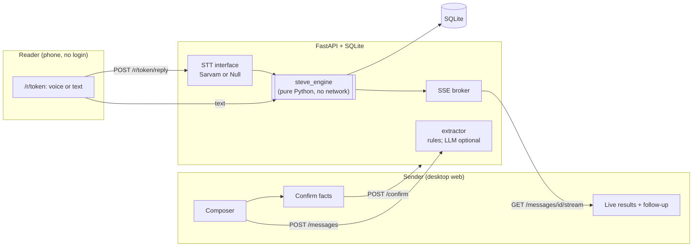

# Architecture

## Design rules (they shape everything)

1. **An LLM never decides whether a fact was understood.** Numbers, doses, frequencies, durations, dates, amounts and
   negations are decided by deterministic code in `engine/`.
2. **The engine runs with zero API keys.** LLM (Gemini) may only *suggest* facts (the sender confirms) and power the eval baseline.
   Speech-to-text (Sarvam) is optional; typed replies always work. `POST /settings/llm` toggles the LLM at runtime (the wrapper test).
3. **No translation anywhere.** The reader's words are shown verbatim.
4. **A false "understood" is the worst error.** Low confidence => `unclear`. A conflicting second value => `unclear`.
5. **Every result is explainable:** evidence spans (character offsets into the original text), matched terms with scores, and a plain-English reason.

## The engine (`engine/steve_engine/`)

| Stage | File | What it does |
|---|---|---|
| clean + tokenize | `normalize.py` | length-preserving digit/quote normalisation, tokens keep code-point offsets, clause/sentence ids, `5days`->`5 days` (only when the letters are a unit word), sound key |
| lexicon | `lexicon.yaml`, `lexicon.py` | fact-bearing words only, per language, spellings by ear, per-language suffix rules. Non-English entries are unverified until `LEXICON_REVIEW.md` is signed off |
| match by ear | `matcher.py` | exact -> suffix-stripped (`dalawa`+`ng`) -> sound key -> guarded fuzzy. <=3-letter words match exactly only; number words never fuzzy-match; ambiguous words (`do`, `la`, `a`) need same-language support; longest phrase wins |
| slots | `slots.py` | numbers count only next to an *anchor* (unit / counter / duration unit / currency). Bare numbers are never guessed. "every 8 hours" -> 3/day, "subah shaam" -> 2/day (inferred, lower confidence) |
| negation | `negation.py` | per-language scope (EN/TL/AR forward; ML/HI bidirectional); each negator claims its nearest target; some words carry their own "don't" (`nirthanda`) |
| compare + decide | `compare.py` | exact equality, set logic for timing, condition = trigger + action (+ negation), "claiming" between facts of the same type, confidence threshold -> `unclear` |
| fallback | `fallback.py` | optional multilingual-e5 similarity for condition facts with no lexicon hit; ships disabled until calibrated (DECISIONS D8) |
| entry | `check.py` | `check_reply(facts, reply, lang_hint) -> list[FactResult]`; `inspect_reply()` powers /how-it-works |

## API (`api/app/`)

| Method & path | Purpose |
|---|---|
| `GET /health` | status + `llm_enabled`, `stt_enabled`, lexicon stats |
| `POST /messages` | text -> suggested facts (rules, or LLM if on) |
| `POST /messages/{id}/confirm` | confirmed facts -> `reader_token`, `reader_url` |
| `GET /messages`, `GET /messages/{id}` | dashboard list, detail with replies + per-fact latest |
| `GET /messages/{id}/stream` | Server-Sent Events: replies + results pushed live |
| `POST /messages/{id}/followup` | re-explain draft for **failed facts only** (templates, no translation) |
| `GET /r/{token}` | reader view: message + prompt. **No facts, no scores** |
| `POST /r/{token}/reply` | multipart `text` or `audio`; audio -> STT (memory only) -> engine; returns `{received: true}`; rate limited |
| `POST /check`, `POST /analyze` | stateless engine calls (playground, inspector, eval) |
| `GET /eval/results` | `eval/results/latest.json` or an empty state |
| `POST /demo/seed`, `GET /demo/scenarios` | demo mode |
| `POST /settings/llm` | runtime LLM toggle |

**Sender authentication:** every sender endpoint (`POST/GET /messages`, `/confirm`, `/followup`, `/stream`, `/demo/seed`, `/settings/llm`) needs the
per-browser `X-Sender-Key` (`sk_…`); the server stores only its SHA-256 hash on the message and answers 403 otherwise. `/stream` also accepts `?key=` because
EventSource cannot set headers. Reader endpoints (`/r/{token}…`) and the stateless/public ones (`/health`, `/check`, `/analyze`, `/eval/results`, `/demo/scenarios`) need no key. See DECISIONS D16.

Per-fact aggregate: for each fact the most recent **non-missing** result wins, so a later reply that doesn't mention a fact never
erases an earlier "understood".

## Web (`web/`)

Next.js App Router, TypeScript strict, Tailwind v4, shadcn/ui (Base UI), Framer Motion (honours `prefers-reduced-motion`),
TanStack Query, Recharts, `qrcode.react`, `sonner`. Reader page is mobile-first and converts recordings to 16 kHz mono WAV in the browser.
Engine offsets are Python code points; the client slices with `Array.from` so emoji highlight correctly.

## Privacy

Audio is read into memory for one STT request and dropped; it is never written to disk or the database. The reader never receives
facts, statuses or scores, and other senders cannot open your messages (sender key, above). The DB stores the reader's text and the per-fact results.
